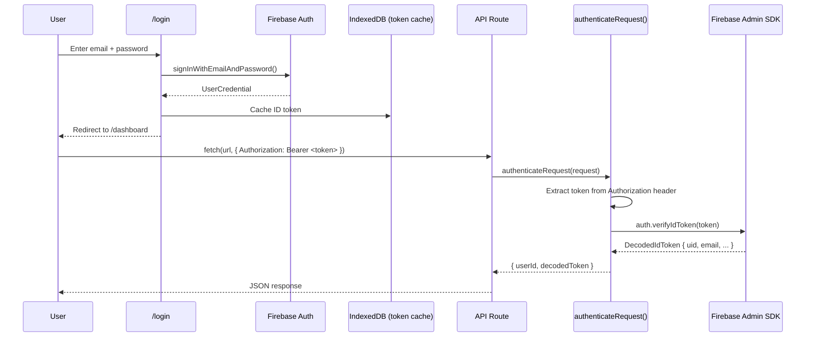

# Authentication Flow

End-to-end auth from login to authenticated API calls.

## Key Files

| File                                   | Role                                |
| -------------------------------------- | ----------------------------------- |
| `src/lib/firebase/config.ts`           | Client-side Firebase init           |
| `src/lib/firebase/admin.ts`            | Server-side Admin SDK init          |
| `src/lib/api/auth-middleware.ts`       | Token verification for API routes   |
| `src/components/auth/AuthProvider.tsx` | React context providing `useAuth()` |

## Token Lifecycle

1. User signs in via Firebase Authentication (email/password or OAuth).
2. Firebase stores the ID token in IndexedDB; it auto-refreshes every ~55 minutes.
3. Client code calls `user.getIdToken()` before each API request.
4. Server-side `authenticateRequest()` verifies the token with `auth.verifyIdToken()`.
5. If the token is expired or invalid, a 401 response is returned.
