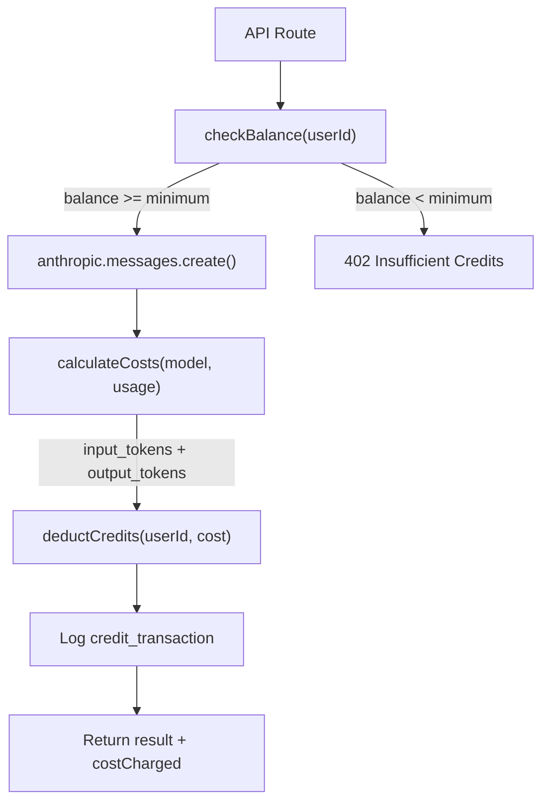

# Credit System Flow

Token-based pricing for AI features.



## How It Works

1. **Balance check** — `checkBalance(userId)` reads the user's current credit balance from Firestore.
2. **AI call** — If the balance is sufficient, the API route calls Anthropic Claude.
3. **Cost calculation** — `calculateCosts(model, usage)` computes the cost in cents from `input_tokens` and `output_tokens`. Costs are always token-based, never fixed.
4. **Deduction** — `deductCredits()` atomically decrements the user's balance and writes a `credit_transaction` document.
5. **Response** — The API returns the AI result along with `costCharged` and `newBalance`.

## Key Files

| File                                    | Role                                                  |
| --------------------------------------- | ----------------------------------------------------- |
| `src/lib/credits/middleware.ts`         | `withCreditTracking()` — wraps non-streaming AI calls |
| `src/lib/credits/balance.ts`            | `checkBalance()`, `deductCredits()`                   |
| `src/lib/credits/pricing.ts`            | `calculateCosts()` — model-specific token pricing     |
| `src/lib/credits/basics-enforcement.ts` | Stricter $1 debt limit for Basics platform            |
| `src/lib/credits/reservation.ts`        | Credit reservation for customer documents             |

## Two Enforcement Tiers

| Platform               | Debt Limit | Wrapper                      |
| ---------------------- | ---------- | ---------------------------- |
| Basics (K-12 learning) | $1         | `withBasicsCreditTracking()` |
| Customer portal        | $50        | `withCreditTracking()`       |

## Streaming Responses

For streaming endpoints, use the two-phase pattern:

```
checkCreditsBeforeCall(userId) → stream response → trackCreditsAfterCall(userId, usage)
```
