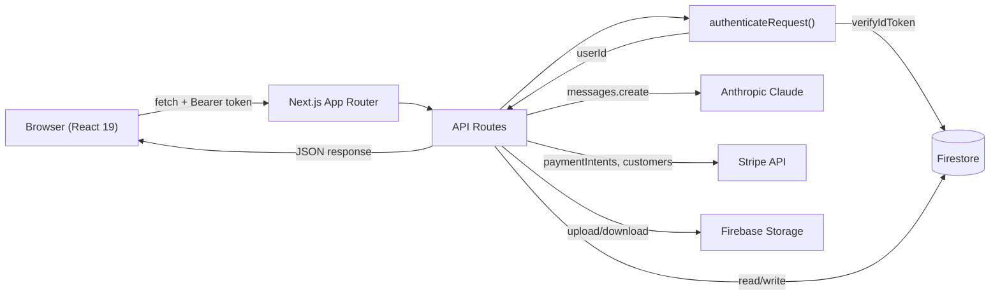

# Data Flow

System-level data flow from browser to backend services.

## Request Lifecycle

1. **Browser** sends a request with a Firebase ID token in the `Authorization: Bearer` header.
2. **Next.js App Router** routes to the matching API handler in `src/app/api/`.
3. **authenticateRequest()** (in `src/lib/api/auth-middleware.ts`) verifies the token via Firebase Admin SDK.
4. The handler performs business logic against **Firestore**, **Claude**, or **Stripe**.
5. A JSON response (`{ success, data }` or `{ success, error }`) is returned to the browser.
